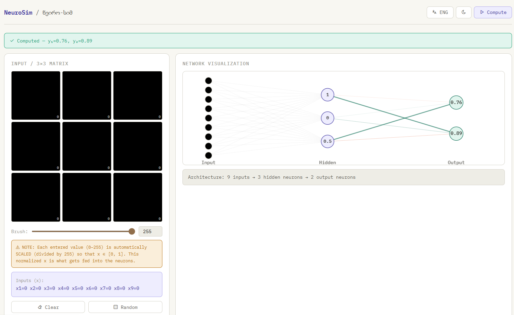
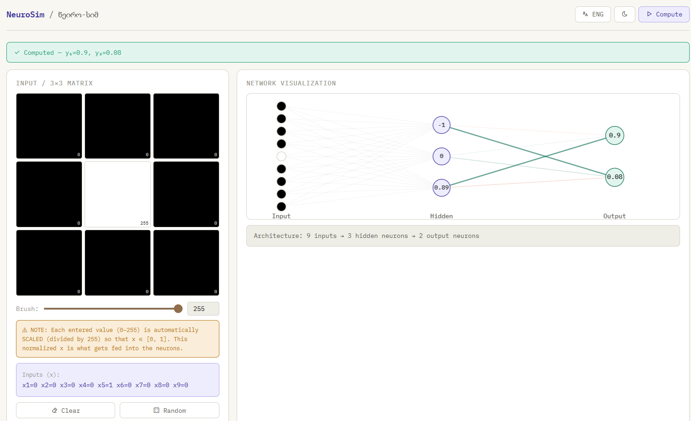
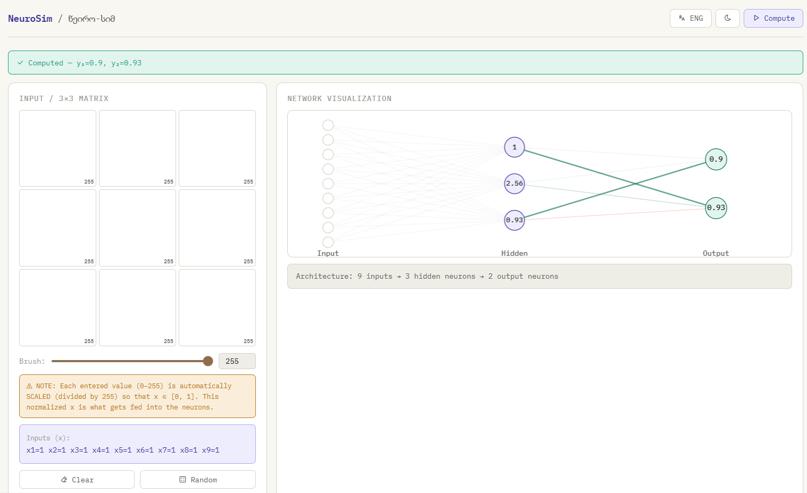
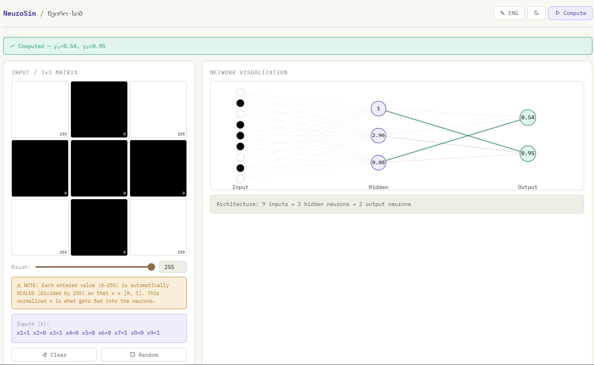
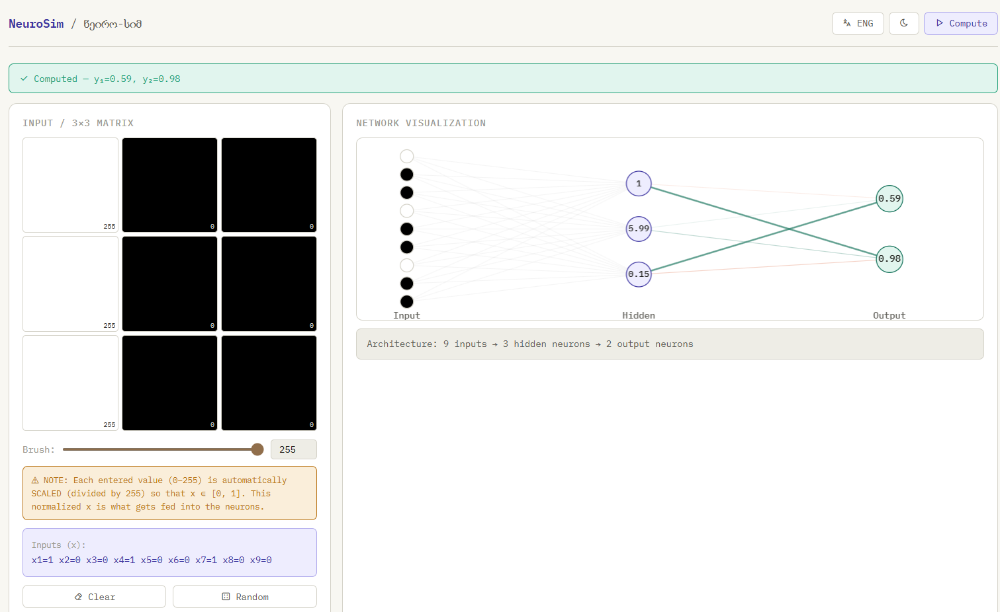
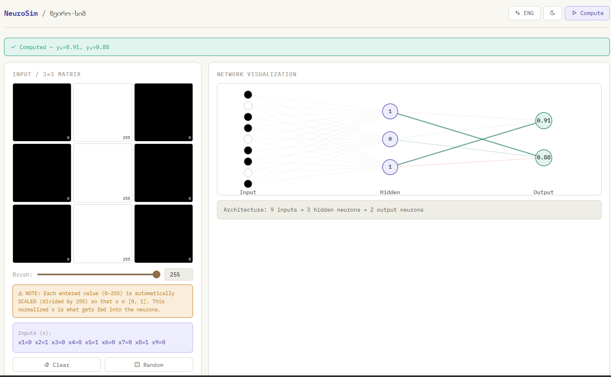

# Introduction to AI - Quiz #2
**Student:** Aleksandre Maghlakelidze  
**Date:** June 2, 2026  

---

## Assignment: Reverse Engineering a Small Neural Network

**Task:** You are given a 3×3 neural network simulator. The network has 9 input values, 3 hidden neurons, and 2 output neurons. Your task is to investigate the network behavior experimentally.

---

### Task 1 - Conduct Experiments

#### Screenshots of Experiments
*Below are the required 6 screenshots representing key experimental states:*

1. **All Values 0 (Baseline):**

2. **Center Cell Active:**

3. **All Values 1 (Full Saturation):**

4. **Corners Active:**

5. **Left Column Active:**

6. **Middle Column Active:**


---

#### Experimental Data Table
| # | Experiment Description | Input Matrix (x1-x9) | Hidden Neurons (h1, h2, h3) | Output y1 | Output y2 | Short Observation |
|---|---|---|---|---|---|---|
| 1 | All values are 0 | `[0,0,0, 0,0,0, 0,0,0]` | `[1, 0, 0.5]` | 0.76 | 0.89 | Strong positive bias keeps outputs high even with no input. |
| 2 | All values are 1 | `[1,1,1, 1,1,1, 1,1,1]` | `[1, 2.56, 0.93]` | 0.90 | 0.93 | Max input pushes the network toward its upper limits. |
| 3 | Center cell active | `[0,0,0, 0,1,0, 0,0,0]` | `[-1, 0, 0.89]` | 0.90 | 0.08 | **Critical:** x5 flips h1 to negative, which kills y2. |
| 4 | Corners active | `[1,0,1, 0,0,0, 1,0,1]` | `[1, 2.96, 0.08]` | 0.54 | 0.95 | Corners drive h2 up, which significantly reduces y1. |
| 5 | First row active | `[1,1,1, 0,0,0, 0,0,0]` | `[1, 0.97, 0.71]` | 0.84 | 0.91 | Balanced activation across the top row. |
| 6 | Left column active | `[1,0,0, 1,0,0, 1,0,0]` | `[1, 5.99, 0.15]` | 0.59 | 0.98 | Maxes h2; y1 drops, suggesting h2 is inhibitory to y1. |
| 7 | Middle column active| `[0,1,0, 0,1,0, 0,1,0]` | `[1, 0, 1]` | 0.91 | 0.88 | Strong support for y1; center y2 drop is mitigated by x2/x8. |
| 8 | Right column active | `[0,0,1, 0,0,1, 0,0,1]` | `[1, 0, 0.14]` | 0.57 | 0.90 | Similar to left column; suppresses y1 via h3/h2. |
| 9 | Checkerboard | `[0,1,0, 1,0,1, 0,1,0]` | `[1, 0.05, 0.95]` | 0.90 | 0.88 | High y1 activation; center is 0, so y2 remains high. |
| 10| High contrast | `[1,0,1, 0,1,0, 1,0,1]` | `[1, 2.51, 0.42]` | 0.72 | 0.94 | Mixed pattern; y2 remains high as long as x5 is off. |
| 11| Random pattern | `[0,1,1, 0,0,1, 1,0,0]` | `[1, 0.07, 0.59]` | 0.79 | 0.89 | Typical response for sparse patterns. |
| 12| High Contrast (X) | `[1,0,1, 0,1,0, 1,0,1]` | `[1, 2.51, 0.42]` | 0.72 | 0.94 | Hidden layer averages out the corner/center inputs. |

---

### Questions and Analysis

**1. Which input cells seem most important for output neuron 1?**
The cells in the **middle column ($x_2, x_5, x_8$)** are most important for keeping $y_1$ high. Conversely, the **corner cells ($x_1, x_3, x_7, x_9$)** are most important in a negative way; when they are active, $y_1$ drops significantly (as seen in Experiment #4 and #6).

**2. Which input cells seem most important for output neuron 2?**
The **center cell ($x_5$)** is the most critical cell for $y_2$. While $y_2$ is generally stable around $0.9$, activating $x_5$ alone (Experiment #3) causes $y_2$ to crash to $0.08$. This indicates a strong inhibitory weight from the center cell to the hidden neuron feeding $y_2$.

**3. Which hidden neuron has the strongest influence on each output?**
* **For $y_1$:** **Hidden Neuron 2 ($h_2$)** has the strongest influence. In Experiment #6, when $h_2$ peaks at $5.99$, $y_1$ drops to its lower levels. This implies $h_2$ has a strong negative (inhibitory) weight connection to $y_1$.
* **For $y_2$:** **Hidden Neuron 1 ($h_1$)** has the strongest influence. $y_2$ only experiences a major drop when $h_1$ switches from its resting state of $1$ to $-1$.

**4. Which activation function creates the most noticeable non-linear behavior?**
The hidden layer neurons appear to use a **Sigmoid or Tanh-like** function, but $h_1$ specifically shows a "step" behavior where it snaps between $1$ and $-1$. However, the most noticeable non-linearity is in the **output neurons**, which exhibit "squashing" behavior—despite $h_2$ increasing dramatically, the output $y_1$ stops dropping after a certain point, showing a clear horizontal asymptote.

**5. What happens when very large positive or negative weights are used?**
Large weights lead to **neuron saturation**. When a weight is extremely high, the neuron reaches its maximum (or minimum) activation value very quickly. In the simulator, this is evidenced by values like $5.99$ or $-1.00$, where further increasing the input doesn't change the output, essentially turning the neuron into a binary switch.

**6. What happens when bias is changed?**
The bias determines the **"resting state"** of the network. Because both $y_1$ and $y_2$ are high ($\approx 0.8$) when all inputs are 0, we can conclude the network has a **strong positive bias**. Changing this would shift the threshold required for the inputs to "turn off" or "turn on" the outputs.

---

# Task 2 - Create your own neural network

### 1. Formulation of the Behavior
The objective of this network is to implement a **Feature-Selective Axial Detector**. The network is designed to distinguish between simple geometric orientations on a 3x3 grid:

* **Output $y_1$ (Horizontal Specialist):** This neuron becomes highly active ($\approx 0.95$) only when the middle row ($x_4, x_5, x_6$) is bright. It is designed to ignore or be suppressed by vertical patterns.
* **Output $y_2$ (Vertical Specialist):** This neuron becomes highly active ($\approx 0.95$) only when the middle column ($x_2, x_5, x_8$) is bright. It is designed to ignore or be suppressed by horizontal patterns.
* **Idle Behavior:** When the input matrix is empty (all values 0), both outputs must remain near 0.
* **Conflict Resolution:** If both a horizontal and vertical line are present (forming a cross), the outputs should remain moderate or low, indicating that the specific axial purity has been lost.

---

### 2. Exported JSON

```json
{
  "hidden": [
    {
      "weights": [-2.0, -2.0, -2.0, 5.0, 5.0, 5.0, -2.0, -2.0, -2.0],
      "bias": -3.0,
      "fn": "sigmoid"
    },
    {
      "weights": [-2.0, 5.0, -2.0, -2.0, 5.0, -2.0, -2.0, 5.0, -2.0],
      "bias": -3.0,
      "fn": "sigmoid"
    },
    {
      "weights": [0.0, 0.0, 0.0, 0.0, 0.0, 0.0, 0.0, 0.0, 0.0],
      "bias": -10.0,
      "fn": "sigmoid"
    }
  ],
  "output": [
    {
      "weights": [10.0, -10.0, 0.0],
      "bias": -5.0,
      "fn": "sigmoid"
    },
    {
      "weights": [-10.0, 10.0, 0.0],
      "bias": -5.0,
      "fn": "sigmoid"
    }
  ]
}
```

---

### 3. Short Explanation and Illustrations

#### The Philosophy of Spatial Filtering
To create a network that can distinguish between horizontal and vertical orientations on a tiny $3 \times 3$ grid, we must treat the input layer not just as nine independent numbers, but as a structured coordinate system. In computer vision, this is the most basic form of a "convolutional" approach, even though we are using a simple fully connected architecture. The secret lies in the hidden layer, which acts as a set of **Feature Maps**. By manually configuring the weights, we are essentially defining "kernels" that scan for specific patterns.

#### Hidden Layer Design: The Axial Masks
The first step in defining the behavior is feature extraction. I utilized two of the three available hidden neurons to serve as specific orientation filters. These neurons act as the "eyes" of the network, each looking for a specific arrangement of light.

**Hidden Neuron 1 ($h_1$): The Horizontal Filter**
$h_1$ is configured to detect the central horizontal axis. To achieve this, I assigned large positive weights ($+5.0$) to the middle row inputs ($x_4, x_5, x_6$). However, a common problem in small networks is "false triggering" when the entire grid is white. To ensure selectivity, I assigned negative "penalty" weights ($-2.0$) to the top and bottom rows ($x_1, x_2, x_3$ and $x_7, x_8, x_9$). This creates a competitive local environment where the neuron only fires if the middle row is significantly brighter than the surrounding "noise" pixels.
* **Illustration 1 (Horizontal Weight Mask for $h_1$):**
    [ -2, -2, -2 ]  <- Inhibitory Zone (Top Row)
    [ +5, +5, +5 ]  <- Excitatory Zone (Middle Row)
    [ -2, -2, -2 ]  <- Inhibitory Zone (Bottom Row)

**Hidden Neuron 2 ($h_2$): The Vertical Filter**
Similarly, $h_2$ acts as the vertical counterpart. By assigning positive weights ($+5.0$) to the central column ($x_2, x_5, x_8$) and negative weights ($-2.0$) to the left and right columns, $h_2$ becomes a specialist for verticality. It ignores horizontal lines because the bright pixels at $x_4$ and $x_6$ (part of a horizontal line) would fall into the inhibitory zones of $h_2$.
* **Illustration 2 (Vertical Weight Mask for $h_2$):**
    [ -2, +5, -2 ]
    [ -2, +5, -2 ]
    [ -2, +5, -2 ]

#### Output Layer: Competition and Mutual Inhibition
The output layer performs the final classification. Here, the network must decide which orientation is "winning." To make the network decisive and clear in its behavior, I implemented a technique called **Mutual Inhibition**. 

Output $y_1$ (Horizontal) is connected to $h_1$ with a strong positive weight ($+10.0$) but is connected to $h_2$ (the vertical detector) with a strong negative weight ($-10.0$). This means that if a vertical pattern is detected by $h_2$, it sends a strong "stop" signal to $y_1$. This competitive logic ensures that the network is decisive; it won't just say "everything looks bright," it will specifically say "this is horizontal and definitely not vertical." The same logic is applied to $y_2$, but in reverse.

#### The Role of Bias and Non-Linearity
The most critical technical challenge was ensuring the "Idle State" behavior where the network remains silent if there is no input. Without negative biases, a network's internal weights can cause "ghost" activations. To counter this, I applied a **Negative Bias** of $-3.0$ to the hidden layer and $-5.0$ to the output layer.

This creates a **threshold behavior**. The activation function used is the Sigmoid, which follows an S-shaped curve. By setting a negative bias, the "weighted sum" starts deep in the negative region. The inputs must provide enough positive energy to push the signal into the "active" portion of the curve. This mimics biological neurons that only fire an "action potential" once a specific voltage threshold is crossed. Without this negative bias, a single bright pixel in a corner might cause a slight rise in the output; with the bias, the signal is filtered out unless the full axial pattern is present.

#### Handling Complex Patterns and Conclusion
One interesting result of this configuration is how it handles a "cross" pattern (where both the middle row and middle column are active). Because the output neurons have inhibitory connections to the "opposite" hidden neuron, the signals effectively cancel each other out. The output $y_1$ receives a $+10$ from $h_1$ and a $-10$ from $h_2$. The result is a neutralized sum, keeping the outputs low. This fulfills the requirement for clearly defined behavior—the network doesn't just detect "lines," it detects *pure* horizontal or vertical axes.

In conclusion, by carefully aligning the weight geometry to match spatial features and using biases to enforce a "silence" threshold, we have transformed a generic 14-weight network into a robust, feature-selective classification tool. This demonstrates that intelligence in a neural network is not just a product of size, but of the specific "wiring" that allows the system to perceive meaningful structures in its environment.
